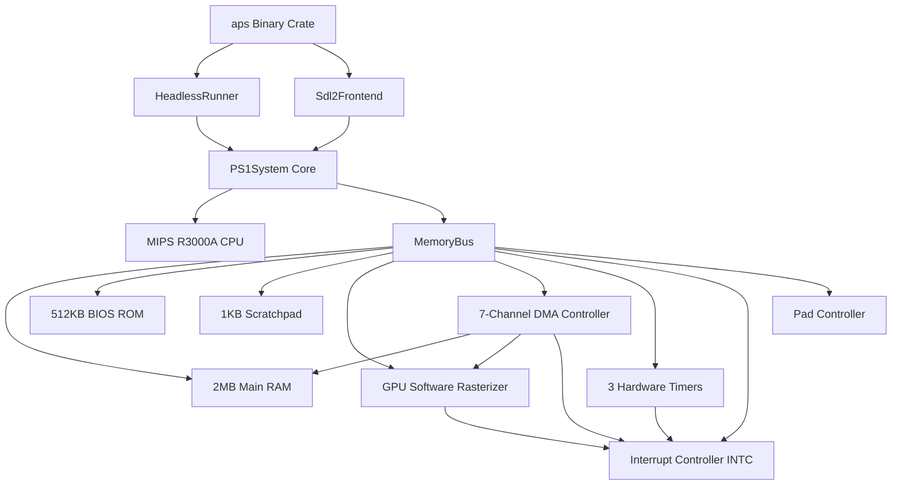

# aps — Clean-Room PlayStation 1 Emulator in Rust

[](https://github.com/iml1s/aps/actions/workflows/ci.yml)
[](https://www.rust-lang.org/)
[](LICENSE)

`aps` is a clean-room, cycle-accurate PlayStation 1 (PS1) emulator implemented from scratch in safe Rust (2021 edition). The project is architected around a single package manager (SPM) Cargo workspace separating hardware emulation core (`ps_core`) from frontend execution drivers (`aps`).

---

## Architecture Diagram

```
+-----------------------------------------------------------------------------------+
|                                    aps (CLI & Frontends)                          |
|                                                                                   |
|    +----------------------------------+    +---------------------------------+    |
|    |      HeadlessRunner (CLI)        |    |      Sdl2Frontend (GUI)        |    |
|    |  - BIOS TTY B0(0x3D) stdout log   |    |  - 60 FPS Sync (564,480 cyc/f) |    |
|    |  - Automated Test Completion     |    |  - VRAM ARGB32 Streaming Texture|    |
|    |  - PPM Framebuffer Snapshot      |    |  - Active-Low Keyboard Mapping  |    |
|    +----------------------------------+    +---------------------------------+    |
+------------------------------------------+----------------------------------------+
                                           |
                                           v
+-----------------------------------------------------------------------------------+
|                                 PS1System Core                                    |
|                                                                                   |
|   +--------------------------+               +--------------------------------+   |
|   |    MIPS R3000A CPU       | <===========> |     MemoryBus (Bus Trait)      |   |
|   |  - 32 GPRs ($0 invariant)|               |  - KUSEG/KSEG0/KSEG1 Masking   |   |
|   |  - HI / LO Registers     |               +--------------------------------+   |
|   |  - 1-cycle Branch Delay  |                               |                    |
|   |  - 2-stage Load Delay    |          +--------------------+--------------------+
|   |  - COP0 Coprocessor      |          |                    |                    |
|   +--------------------------+          v                    v                    v
|                                  +-------------+      +--------------+     +--------------+
|                                  |   2MB RAM   |      |  512KB BIOS  |     | 1KB Scratch  |
|                                  | (Mirrored)  |      |   (SCPH1001) |     |  (Fast D-Cache)
|                                  +-------------+      +--------------+     +--------------+
|                                                              |                    |
|                                         +--------------------+--------------------+
|                                         |
|                                         v
|   +---------------------------------------------------------------------------+   |
|   |                             Subsystems & I/O                              |   |
|   |                                                                           |   |
|   |  +--------------------+   +-------------------+   +--------------------+  |   |
|   |  |   7-Channel DMA    |   | GPU Software RAST |   |  3 Hardware Timers |  |   |
|   |  | - Ch0..6 (GPU, OTC)|   | - GP0 / GP1 Cmds  |   | - Timer 0, 1, 2    |  |   |
|   |  | - Block & LinkedList|  | - 1MB BGR555 VRAM |   | - SysClock/HBLANK  |  |   |
|   |  +--------------------+   +-------------------+   +--------------------+  |   |
|   |                                     |                                     |   |
|   |                                     v                                     |   |
|   |                           +-------------------+                           |   |
|   |                           | INTC (I_STAT/MASK)|                           |   |
|   |                           | - 11 IRQ Lines    |                           |   |
|   |                           +-------------------+                           |   |
|   +---------------------------------------------------------------------------+   |
+-----------------------------------------------------------------------------------+
```



---

## Core Features

- **MIPS R3000A CPU Core**:
  - 32-bit RISC interpreter operating at 33.8688 MHz.
  - 32 General Purpose Registers with hardwired `$0 = 0` invariant.
  - `HI` and `LO` registers for 64-bit multiplication (`MULT`, `MULTU`) and division (`DIV`, `DIVU`).
  - 1-cycle Branch Delay Slot execution tracking.
  - 2-stage Load Delay Pipeline handling register writeback latencies and branch read overrides.
  - System Control Coprocessor (COP0) with `Status`, `Cause`, `EPC`, `BadVAddr`, and `PRId` registers.
  - Full exception handling (`Syscall`, `Break`, `ReservedInstruction`, `UnalignedLoad`, `UnalignedStore`, `Overflow`).
  - Native BIOS vector interception for stdio TTY printing (`putchar`, `puts`, `printf`).

- **Bus Trait & Memory Mapper**:
  - Decoupled `Bus` trait enabling clean unit testing with `MockBus`.
  - Physical address masking (`vaddr & 0x1FFF_FFFF`) mapping `KUSEG`, `KSEG0`, and `KSEG1` to the 512MB physical address space.
  - 2MB Main RAM with full 8MB region mirroring.
  - 512KB BIOS ROM loading (SCPH1001.BIN).
  - 1KB Scratchpad fast data cache (0x1F80_0000).

- **GPU Subsystem & Software Rasterizer**:
  - 1MB VRAM organized as 1024 x 512 16-bit BGR555 pixels.
  - Full GP0 drawing command processor (Fill Rectangle, Flat/Gouraud Triangles, Rectangles, CPU-to-VRAM, VRAM-to-CPU).
  - Full GP1 control processor (Reset, Command Buffer Clear, Acknowledge IRQ, Display Enable, Display Mode, GPUSTAT register).
  - Software rasterizer with edge-function / barycentric coordinate evaluation, Gouraud color interpolation, scissor clipping, and coordinate offsets.
  - VRAM color format conversion from 16-bit BGR555 to 32-bit ARGB8888.

- **7-Channel DMA Controller**:
  - Channels: 0 (MDEC in), 1 (MDEC out), 2 (GPU), 3 (CDROM), 4 (SPU), 5 (PIO), 6 (OTC).
  - Transfer modes: Single-Block (Mode 0), Multi-Block (Mode 1), and Linked-List traversal (Mode 2 for GPU packet headers).
  - Hardware Ordering Table Clear (OTC) linked list pointer chain generator.
  - `DPCR` channel control and `DICR` interrupt control with write-1-to-clear bitmask semantics.

- **Timers & Interrupt Controller**:
  - 3 16-bit hardware timers (Timer 0: Dot Clock/SysClock, Timer 1: HBLANK/SysClock, Timer 2: SysClock / SysClock/8).
  - Modes: Target Match IRQ, Overflow IRQ, One-shot vs Repeat.
  - Interrupt Controller (`INTC`) managing 11 interrupt lines via `I_STAT` (0x1F80_1070) and `I_MASK` (0x1F80_1074).

- **Dual Frontend Architecture**:
  - **Headless Mode (`--headless`)**: Non-interactive runner with BIOS TTY output interception, automated test completion detection, and `.ppm` framebuffer screenshot generation.
  - **SDL2 GUI Mode**: 60 FPS real-time rendering window, streaming texture update, and PS1 digital controller key mapping.

- **4-Tier Automated Verification Suite**:
  - Tier 1: Unit tests for MIPS instructions and memory routing using `MockBus`.
  - Tier 2: Boundary tests for unaligned access exceptions, segment aliasing, and memory mirroring.
  - Tier 3: Integration tests for CPU-DMA-GPU pipelines, timer-INTC interrupt propagation, and controller IO mapping.
  - Tier 4: Automated E2E test harness (`scripts/run_ps1_tests.sh`) executing the Amidog CPU test suite (`psxtest_cpu.exe`) passing all 101/101 verification assertions.

---

## Prerequisites

- **Rust**: 1.70+ with `cargo` and `rustc` (2021 edition).
- **SDL2 Library**:
  - **macOS**: `brew install sdl2`
  - **Ubuntu/Debian**: `sudo apt-get install libsdl2-dev`
  - **Windows**: Included via `vcpkg` or standard MSVC build dependencies.

---

## Build & Run Instructions

### Building the Project

```bash
# Build debug binary
cargo build

# Build release binary (recommended for performance)
cargo build --release
```

### Running the Emulator

#### 1. Headless CLI Mode

Run an executable ROM without launching a GUI window:

```bash
cargo run --release -- --headless tests/roms/psxtest_cpu.exe
```

CLI Arguments for Headless Mode:
- `--headless`: Run without GUI window.
- `--bios <PATH>`: Path to PS1 BIOS image (default: `bios/SCPH1001.BIN`).
- `--max-cycles <N>`: Auto-terminate after `N` CPU cycles.
- `--tty-log <PATH>`: Save BIOS TTY console output to file.
- `--screenshot <PATH>`: Save final VRAM framebuffer as `.ppm` image.

#### 2. SDL2 GUI Mode

Launch the interactive window frontend:

```bash
cargo run --release -- tests/roms/psxtest_cpu.exe
```

Display Modes:
- `--display-mode windowed`: Standard 640x480 PS1 aspect window (default).
- `--display-mode vram_debug`: 1024x512 full VRAM inspector window.

#### Controls (Default Keymap)

| PS1 Controller Button | Keyboard Key |
|-----------------------|--------------|
| D-Pad Up / Down       | Up / Down    |
| D-Pad Left / Right    | Left / Right |
| Cross (✕)             | `Z`          |
| Circle (◯)            | `X`          |
| Square (☐)            | `A`          |
| Triangle (△)          | `S`          |
| L1 / R1               | `Q` / `W`    |
| L2 / R2               | `E` / `R`    |
| Select                | `Shift`      |
| Start                 | `Space`      |
| Quit                  | `Esc`        |

---

## Verification & Testing

### Running the Full Test Suite

```bash
# Run all workspace unit, boundary, and integration tests
cargo test --workspace

# Run specific tier test target
cargo test --test tier1_unit_tests
cargo test --test tier2_boundary_tests
cargo test --test tier3_integration_tests
cargo test --test tier4_rom_tests
```

### Automated Test ROM Runner

Execute the automated test runner script to download/cache the Amidog PS1 CPU test ROM, compile `aps` in release mode, run the headless suite, and verify all 101 CPU test assertions:

```bash
./scripts/run_ps1_tests.sh
```

### Code Formatting & Linting

```bash
# Verify code formatting
cargo fmt --check

# Enforce zero warnings across workspace
cargo clippy --workspace --all-targets -- -D warnings
```

---

## Workspace Layout

```
aps/
├── Cargo.toml                  # Workspace manifest
├── README.md                   # High-level documentation & overview
├── CLAUDE.md                   # Developer & AI assistant project guide
├── ARCHITECTURE.md             # In-depth technical architecture spec
├── GH_METADATA.md              # Repository metadata & release configuration
├── .github/
│   └── workflows/
│       └── ci.yml              # Multi-platform (Linux/macOS/Win) GitHub CI/CD
├── crates/
│   ├── ps_core/                # Hardware emulation library crate (100% safe Rust)
│   │   ├── src/
│   │   │   ├── lib.rs
│   │   │   ├── system.rs       # System wrapper (CPU + Bus)
│   │   │   ├── cpu/            # MIPS R3000A CPU core & COP0
│   │   │   ├── bus/            # Bus trait, Memory mapper, MockBus
│   │   │   ├── ram/            # 2MB Main RAM
│   │   │   ├── bios/           # 512KB BIOS ROM loader
│   │   │   ├── scratchpad/     # 1KB Data Scratchpad
│   │   │   ├── gpu/            # GPU GP0/GP1 & Software Rasterizer
│   │   │   ├── dma/            # 7-Channel DMA Controller
│   │   │   ├── timers/         # 3 Hardware Timers
│   │   │   ├── intc/           # Interrupt Controller (I_STAT/I_MASK)
│   │   │   └── controller/     # Controller I/O keymap
│   └── aps/                    # CLI & Frontend binary crate
│       ├── src/
│       │   ├── main.rs         # Binary entrypoint
│       │   ├── cli.rs          # Argument parser (clap)
│       │   ├── headless.rs     # Headless runner & TTY logger
│       │   └── sdl2_frontend.rs# SDL2 GUI rendering & event loop
├── scripts/
│   └── run_ps1_tests.sh        # Automated test ROM harness script
└── tests/                      # 4-Tier test suite files
    ├── tier1_unit_tests.rs
    ├── tier2_boundary_tests.rs
    ├── tier3_integration_tests.rs
    ├── tier4_rom_tests.rs
    └── roms/                   # Cached test ROMs (psxtest_cpu.exe)
```

---

## License

This project is licensed under the [MIT License](LICENSE).
